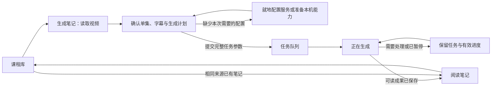

**course2md UX 重构规格 · v1 · 2026-09-07**

**交付状态：设计规格，待实施。** 本文定义新的页面、文案、状态与验收标准；不代表相应功能已经实现。以 [UX 审查报告](/Users/aac6fef/Developer/course2md/docs/UX-AUDIT-2026-09-06.md) 的 48 项问题为依据，结合添加、设置、任务与阅读三个 subagent 的方案完成统一设计。

设计目标：**用户确认视频和处理方式后，清楚地得到一份可阅读、可追溯的笔记；软件负责保存状态、检查条件、恢复进度和保护已有成果。**

本文中的具体课程、时间和统计用于说明有真实数据时的显示方式。实现时绑定实际数据；没有数据就省略对应信息或说明未知的原因。示例文字、花括号变量、假进度和测试服务地址不得出现在成品界面中。

**阅读导航：** [原则与范围](#spec-01) · [完整旅程](#spec-02) · [状态归属](#spec-03) · [生成页](#spec-04) · [设置](#spec-05) · [任务恢复](#spec-06) · [课程库与存储](#spec-07) · [阅读导出](#spec-08) · [文案与可访问性](#spec-09) · [实现与迁移](#spec-10) · [验收](#spec-11) · [48 项映射](#spec-12)

**01 · 产品原则与最终决定**

| 原则 | 必须产生的产品行为 | 验收时拒绝的表现 |
| --- | --- | --- |
| 不让用户疑惑 | 动作命名说明结果；开始前说明处理哪个视频、使用哪份文字、是否调用服务、笔记放在哪里 | “添加并开始”“已连接”“需要配置”这类没有对象或下一步的独立文案 |
| 软件状态由软件负责 | 草稿、已保存设置、任务参数、检查点和成果各有明确身份；普通重试自动复用安全进度 | 让用户勾选恢复开关、重填来源、记住旧目录、根据日志猜任务是否成功 |
| 技术信息帮助判断和排错 | 可以显示模型 ID、接口协议、服务域名、错误码、真实日志；信息与对应选择或故障关联 | 把原始异常直接当解释，或隐藏真实服务、实际发送内容与影响成本的操作 |
| 每一行信息都有用途 | 信息至少帮助选择、解释影响、报告事实或完成恢复；字段有持久标签 | “暂无封面”“未知作者”“待完善”“敬请期待”、无含义的短 ID、不能填写的假服务地址 |
| 大幅重构交互，可靠保留资料 | 允许替换页面、配置结构和任务模型；已有笔记、人工编辑、有效服务与分类受到保护 | 用“抛弃历史包袱”解释数据丢失、静默改用新服务或覆盖旧成果 |

采用以下确定方案：

1. 主流程固定为“读取视频 → 确认内容和生成计划 → 生成笔记 → 阅读笔记”。生成动作放在表单末端的固定操作区。
2. 左侧常驻“课程库、生成笔记、任务、设置”。设置改为“生成笔记、服务与账号、存储、应用”四组，首次使用直接进入产品。
3. 删除“继续上次未完成的转换”设置；普通继续和重试始终自动评估并复用兼容的进度。
4. 内部笔记始终可读。Markdown、网页文件和 JSON 是可选的导出产物，允许全部不选。
5. “AI 整理”拆成“AI 校对”和“生成摘要”；发送截图的能力单独说明。服务地址、模型与发送内容必须和本次计划一致。
6. 失败记录属于任务；课程库中的正常笔记必须有可读成果。部分完成要写清哪部分可用、哪部分未完成。
7. 再次生成写入新版本。打开已有笔记是发现重复来源后的默认动作；新版失败时旧版继续可读。
8. 草稿和设置及时持久保存；开始生成时形成不可变的完整任务参数。页面切换、设置变更与重试不得改变任务身份。

**统一用词**

| 名称 | 含义与使用位置 |
| --- | --- |
| 视频 | 本次处理的一个在线单集或一个本地文件；来源卡明确范围 |
| 笔记 | 由视频生成的正文、时间定位、截图和可选摘要；主按钮为“生成笔记” |
| 课程库 | 已保存笔记的集合；任务失败记录不算作一篇正常笔记 |
| 文件夹 | 库内逻辑分类；改变分类不移动视频或导出文件 |
| 存储位置 | 受应用管理的课程库目录；与向外导出文件的目标位置分开 |
| 任务 | 已提交的一次生成工作；有自己的来源、参数、进度和结果 |
| 生成方式 | 字幕或语音识别、AI、截图与导出等本次处理选择 |
| 技术详情 | 对当前步骤有解释价值的模型、版本、协议、错误码及日志；展开后展示 |

**02 · 导航与完整用户旅程**

| 页面 | 用户在这里完成什么 | 常驻主动作 | 离开与返回 |
| --- | --- | --- | --- |
| 课程库 | 找到、分类和继续阅读笔记 | 生成笔记 | 保留查询、文件夹、展开状态和滚动位置 |
| 生成笔记 | 确认来源与处理计划 | 生成笔记；已有任务运行时为“加入队列” | 保留完整草稿；来源类型切换也保留各自输入 |
| 任务 | 查看执行情况、暂停、继续和处理失败 | 随选中任务状态确定 | 每项始终带视频名；当前草稿不充当重试参数 |
| 阅读笔记 | 阅读、定位原视频、复制或导出 | 复制纯文本 / 导出 | 返回原来的库筛选或任务；保留段落位置 |
| 设置 | 设定默认生成方式，管理服务、位置和应用 | 普通选项自动保存；服务与位置用具体提交动作 | 从生成页进入时明确“返回生成笔记”，回到原字段和位置 |

首次启动显示课程库空态：“把视频变成可阅读的课程笔记。”主动作“生成第一篇笔记”。不要求先选择识别后端、填写 API Key 或完成一套设置向导。读取来源后，只处理这次任务真正需要的条件。已经有库但暂时读不到时显示位置问题，不能显示首次使用空态。

**03 · 状态归属与提交规则**

以下是工程必须支持的独立状态，属于实现规格，不作为一组技术名词摆进产品页面。

| 状态 | 保存什么 | 可以被什么改变 | 用户可见承诺 |
| --- | --- | --- | --- |
| 添加草稿 | 在线/本地来源、预览对应身份、字幕选择、笔记名称、文件夹、本次覆盖项、滚动与返回位置 | 用户修改；软件刷新证据；未覆盖项跟随有效默认 | 去设置、切来源类型、重启后仍能继续填写 |
| 生成默认 | 新任务的文字策略、识别偏好、AI 和导出偏好 | 对应设置组验证和保存成功 | 清楚说明影响准备中的任务，已开始任务保持原参数 |
| 服务编辑草稿 | 正在填写的服务字段和字段错误 | 编辑服务；独立保存草稿 | 未填完一个服务不会阻止别组保存，也不会替换正在使用的服务 |
| 有效服务版本 | 明确启用的地址、协议、模型、凭据引用及发送能力 | “保存服务”成功，更新创建新的服务配置版本；按入口绑定本次或默认引用 | “已保存”只表示配置保存，不冒充服务已验证 |
| 任务记录 | 来源身份、确认标题、所选字幕、完整处理参数、库与文件夹 ID、服务版本引用、各阶段状态 | 提交创建；状态推进；明确的调整生成新修订 | 执行参数与开始前的计划一致；之后不再读可变的页面输入或全局配置 |
| 阶段进度 | 已验证的下载、字幕、识别分段、截图和 AI 结果；尚不确定的外部请求 | 对应阶段完成并落盘 | 软件决定哪些可复用；用户只决定是否继续工作 |
| 笔记版本 | 可读文档、真实来源、图片清单、处理状态、导出清单 | 新版原子发布；明确的版本选择 | 失败不覆盖旧文稿；导出选项不影响内部阅读 |
| 界面偏好 | 选中页面、库筛选、每篇每页签阅读锚点 | 对应界面交互 | 返回时保持上下文，不强制回到顶部 |

**点击“生成笔记”的提交顺序**

1. 固定本次草稿标识与来源证据版本，阻止重复提交同一个动作。
2. 同步提交本次依赖的普通偏好，读取本次覆盖与有效默认，形成完整参数。服务只读取已按“保存服务”提交的有效版本；生成动作不会替用户启用尚在编辑的服务草稿。普通偏好提交失败则定位具体字段或保存故障，保留当前草稿。
3. 校验实际字幕、所需本机能力、所选服务、源文件、目标库可写性及当前来源已有任务/笔记。没有用到的服务字段不参与阻断。
4. 如有效计划相较用户刚看到的内容发生改变，更新计划并停在生成页。涉及识别路线、模型、外发内容或目标位置的变化需要再次提交；不能点击后悄悄替换。
5. 原子保存任务记录和固定参数，再交给队列。任务保存失败时不启动下载、识别或服务请求。
6. 提交成功后显示这个任务，添加草稿转成“已提交”关联态；输入另一个视频建立独立草稿。再次点击不会再排入同一任务。

草稿更新依赖实时字段值，正确性不依赖 700ms 防抖等时间窗口。恢复、排队执行与失败重试读取任务记录。为了保护凭据，任务持有安全存储中的凭据版本引用，不把密钥写进命令行、普通任务 JSON、日志、截图或诊断包。当前实现为 GPUI + Rust；本规格要求对应的原生可访问性与持久化行为，不依赖网页 DOM 或 SwiftUI 架构。

**04 · 生成笔记页面**

**页面结构：一张连续表单**

| 从上到下 | 正常状态 | 需要时展开 |
| --- | --- | --- |
| 来源 | “在线链接 / 本地视频”；视频链接字段或“选择视频” | 当前读取步骤、取消读取、明确的来源错误和修复动作 |
| 所选视频 | 真实标题、平台或文件名、已知时长；“本次处理 1 个视频” | 分集选择、完整来源详情；封面有数据才显示 |
| 笔记内容 | 实际文字来源＋“更换”；AI 校对/生成摘要及已启用规则 | 字幕候选、识别位置/模型/服务、AI 服务与规则 |
| 名称与保存 | “笔记名称”；“保存到”显示已选库位置及文件夹 | 更改文件夹、新建文件夹、查看实际磁盘位置 |
| 可选产物 | “同时导出文件”；在线来源的“保留视频供离线播放” | 选择格式、目标位置；有已启用规则时折叠摘要仍可见 |
| 生成操作区 | 本次计划＋“生成笔记” | 已有工作运行时“加入队列”；重复来源时“打开已有笔记 / 生成新版笔记” |

分组以标题和留白表达，避免每个控件单独占一张大卡片。生成方式可以收起，底部计划不能一起消失。主操作只有一处；不在页头再复制一套。没有来源时只呈现输入动作，名称与字幕等依赖信息不铺空架子。

**来源输入与读取**

在线字段名为“视频链接”，必要说明为“粘贴视频页面链接，会自动读取视频信息。”完整 URL 粘贴后约 500ms 自动读取；Enter 或“读取视频”立即读取。逐字输入时不对每个看似合法的半成品 URL 发请求，在结束编辑或明确读取后请求。重复粘贴同值且已有有效结果不再请求。

分享文本只有一个明确 URL 时提取并在字段中显示实际采用的地址；多个 URL 显示候选供单选。读取阶段只确认来源、范围和可获取的字幕，不启动完整视频下载、模型下载、语音识别或 AI。

读取文案按实际步骤显示“正在读取视频信息…”“正在查找可获取的字幕…”，提供“取消读取”。取消保留输入，不变成红色任务失败。输入错误用“请粘贴视频页面的完整链接。”并关联字段；错误链接不清空。自动读取返回不抢焦点、不强行滚动。

本地区域显示“把视频拖到这里，或选择文件。”和“选择视频”；有文件后为“更换视频”。选择和拖入走相同校验路径：选择器筛选支持的视频类型，后端检查实际媒体内容。拖入多个文件显示单选候选，不能忽略其余文件后直接处理第一个。本地检查内嵌文本字幕、同名 SRT/VTT，并允许“选择字幕文件”附加不同名文件。原视频和附加字幕留在原位置。

**草稿与单集范围**

- 在线、本地至少各有一份完整持久草稿；从失败任务调整会建立独立重试草稿。新来源不占用已提交任务的参数，任务 A 和准备中的 B 可同时存在。
- 侧栏“生成笔记”恢复最近编辑的未提交草稿；没有草稿才新建。页面在确有多份草稿时提供“草稿”选择器，以真实视频标题、文件名或已填来源区分，重试项显示“调整《视频名》”。空白未开始草稿不堆入列表。调整 A 后可以从这里回到 B；“生成另一篇笔记”创建新草稿而不覆盖旧稿，草稿菜单可明确丢弃选中草稿。
- 草稿持有来源修订。异步结果必须匹配草稿 ID 与当前来源修订；取消读取、切换来源和迟到结果均不能把 A 的信息放进 B。
- 初次填入笔记名称使用解析标题，本地没有可靠标题时用真实文件名；用户改名后标为自定名称。同草稿换链接时保留自定名称与文件夹，自动名称随新来源更新。点击“生成另一篇笔记”则建立新草稿并重新采用默认规则。
- 普通新建使用默认保存位置和未分类；文件夹页的明确入口“在此文件夹生成笔记”才使用该库和该文件夹，新建时优先于默认位置。普通导航恢复已有草稿时不因筛选或默认位置改变归属。重开应用先恢复草稿，再验证源文件、字幕和服务引用，不把旧验证结果冒充当前可用。
- 在线身份包含平台稳定视频 ID 和分 P 身份；本地身份以内容验证，不以文件名、显示标题或存放路径为唯一依据。完整内容核验可以在真正需要复用前进行，不必为了预览先散列整部大视频。
- 普通单视频显示“本次处理 1 个视频”；分集只显示来源明确给出的信息。合集可可靠列举时显示候选供单选，实际执行使用所选单集身份；无法可靠列举或确认时写“还无法确定要处理哪个视频。请复制具体视频的链接。”，提供“打开原页面 / 重新读取”。不猜第一集，也不从标题字符串猜集序。

**文字来源按证据呈现**

旧的“字幕优先 / 仅字幕 / 语音识别”三个常驻按钮取消。先展示这个视频实际可用的文字，允许明确更换。

| 真实状态 | 页面表达 | 默认下一步 |
| --- | --- | --- |
| 查找中 | 正在查找可获取的字幕… | 等待或取消当前读取；不提前写“使用中文字幕” |
| 找到轨道，正文尚未读到 | 找到简体中文字幕，正在读取… | 读取并验证有效文字；语言只用真实元数据 |
| 已读取可用字幕 | 文字来源：简体中文 · 人工字幕；更换 | 使用该字幕；类型不明时省略类型；无需配置识别引擎 |
| 已成功检查支持的字幕渠道，无可读结果 | 未找到可直接读取的字幕 | 准备“识别视频声音”的计划；本地另可“选择字幕文件”；尚不执行 |
| 网络/权限导致字幕失败 | 字幕未读取成功，尚不能确认是否可用 | 重新读取字幕 / 登录后重试；用户可明确“改用语音识别” |
| 当前来源不支持提取字幕 | 此来源暂不支持读取字幕，可以识别视频声音 | 显示识别方案；不声称视频本身没有字幕 |
| 本地字幕无有效文字/解析失败 | 这份字幕未包含可读取的文字，或具体解析问题 | 选择其他字幕；保留上次有效选择和原视频 |

字幕排序完整规则为：用户指定的优先语言 → 界面语言 → 来源明确标注的原声语言 → 其余来源顺序，逐级去重；每级未命中都继续后一级。没有语言偏好时直接从界面语言开始。同语言优先人工字幕，再自动字幕；只有来源确实区分时才按类型排序。偏好中文但只有法语时仍选择并明确显示法语，不判成无字幕。所有发现的语言都可选择，不限中文和英文。

“更换文字来源”列出实际轨道、附加字幕及“识别视频声音”。换轨道时先读新正文；成功前保持旧选择记录并明确“正在确认字幕”，不能直接提交旧内容。用户主动选择的字幕若随后失效，不自行换语言或外发音频。保存到任务的字幕内容/可靠引用与其身份必须一致。

**识别和 AI 只显示实际分支**

选择识别后，呈现“在这台电脑上识别”与“使用识别服务”，标明实际引擎/模型或已配置服务。多个本机方式的展开入口叫“选择本机识别方式”。没有字幕已足够的场景不要求用户选择 ASR。

本机设备存在不等于模型已就绪。缺模型但应用可自行准备时写“首次使用会先下载识别模型”，跟随真实模型名及已知体积；加入任务计划，提交后先准备模型再做昂贵的视频获取。应用可管理的组件提供“安装并继续”；系统级依赖需要外部操作时提供具体安装方法和就地重检。不会自动执行未经用户选择的系统安装命令。

云端缺项时直接出现“设置语音服务”，服务配置在本页的受控面板完成。完整但未主动测试的配置可以生成；“尚未测试”只在首次选用/实质修改时说明，不作为重复警告或隐形必经关卡。保存、测试、已知失效与真实远程错误遵循第 05 节。

“AI 校对”说明“修正识别错误和标点，保留原意”；“生成摘要”说明“提炼课程要点，正文继续保留”。两项可独立开关；截图辅助只附属于校对，见设置规则。启用任何一项就显示实际服务和发送内容。技术设置来自旧配置也必须反映在计划中。

本机识别只保证音频在本机处理，不能据此写“所有内容留在本机”：后续 AI 可能把文字和截图发给另一个服务。正常摘要可以写“音频在本机识别；校对文字发送到「所选服务的实际名称」”，其中名称由已选配置绑定。

**就地配置与保存归属**

服务设置、登录和工具准备携带草稿 ID、当前修订、滚动锚点和焦点目标。面板打开后背景不可编辑，保存或取消后精确返回。同一服务表单统一使用“保存服务”；从生成页进入时说明“保存后用于本次笔记”。即使编辑已有共享服务，成功也只创建并固定本草稿的配置版本，不推进其他草稿继承的默认版本。独立选项“同时设为默认服务”默认关闭；选中才更新该用途的默认服务及配置版本，仍不自动开启全局 AI 效果。

未填完的服务内容保存在其编辑草稿里，退出面板后原来有效服务仍可使用。没有有效服务而本次确实需要时，保留具体缺项与配置动作。触发按钮因配置成功而消失时，焦点回到同组的服务选择控件。

正常来源不铺常驻账号状态行。账号信息收在“来源详情”，例如“Bilibili：已登录 · 实际昵称”；遇到权限问题就地提供“登录 Bilibili”。暂时验证失败保留登录，先“重新检查”；明确失效时才“重新登录”。

“保存到”同时辨认已登记存储位置与逻辑文件夹。只有一个位置时以文件夹为主，展开可查看磁盘路径；多个位置同名时显示足以区分的名称及路径摘要。文件夹被删除后保留原名称并说明“文件夹已删除。请选择其他文件夹，或保存到未分类。”，不能静默重新归类。新建文件夹在受控对话框内完成，成功即选中。

**导出与视频保留**

默认只生成内部笔记，完成后可“导出”。需要自动导出时展开“同时导出文件”：

| 选择 | 用途 | 自动导出的产物 |
| --- | --- | --- |
| Markdown 包 | 在笔记软件中编辑，包含图片资源 | ZIP 内的 Markdown 文稿和本版引用图片 |
| 网页文件 | 在浏览器中阅读和分享 | 内嵌本版图片的单个 HTML 文件 |
| JSON 数据 | 给程序使用的正文、图片 ID 和时间信息 | 有结构版本的 JSON；不含图片文件，不写依赖本机目录的图片路径 |

全部不选合法，多选生成对应产物。自动导出同时显示目的位置；失败只补做导出，不影响内部阅读，也不重做识别。复制 Markdown 文本与导出 Markdown 包是不同动作。

在线来源的“保留视频供离线播放”说明“生成后保留下载的视频，会占用额外空间”，详情有真实保存位置。未选择时，软件仍保留恢复所需的临时媒体，不能为了能恢复而要求勾选离线播放。本地来源省去此项。

**计划、提交与异常**

计划通常控制在 2–4 条，信息增加时允许展开完整计划。优先说明所选文字、真实服务与外发范围、保存归属；首次模型准备、自定义校对、额外导出等对本次有影响时出现。在线即使用字幕仍需获取画面，应写明“下载所选视频，提取画面”；不误导为全程无需视频。

无输入时主按钮允许触发校验，将焦点送到来源：“先粘贴视频链接”或“先选择一个视频”。已知阻断在对应组内直接给修复动作；点击生成定位第一处问题。读取/提交期间防重复，保留动作名称并说明正在做什么。没有实际请求时不显示假加载。

提交遵循第 03 节。队列忙时同一位置显示“加入队列”，说明等待当前任务，不预测等待时长。重复点击通过任务身份和参数幂等处理；不能只靠按钮变灰。发现同来源已有笔记时主动作“打开已有笔记”，另有“生成新版笔记”；已有相同活动任务则“查看任务”，同时显示该任务真正采用的名称和保存归属。

若当前草稿只改了名称或文件夹，不得把“查看任务”说成这些改动已提交。说明“已有任务的名称和文件夹保持不变，本草稿的更改尚未应用”，保留草稿；完成后可明确重命名、移动现有笔记，或按此草稿“保存笔记副本”。这些操作不重新识别，也不修改已经执行的快照。

错误恢复固定保留来源、名称、所选字幕、归属与本次参数。字幕失败、模型准备失败、不可写目录和源文件被移动都进入各自的修复路径；不会统一引导“检查网络”，也不会把这些错误丢给用户通过清缓存或重新添加来处理。

**05 · 设置页面与首次使用**

**四个设置组**

| 分组 | 内容 | 页面约定 |
| --- | --- | --- |
| 生成笔记 | 字幕语言偏好、需要识别时的本机/服务方式、AI 校对、生成摘要、截图辅助、自定义规则、同时导出、在线视频保留偏好 | 顶部只出现一次范围说明；实际选项与生成页共享解析规则 |
| 服务与账号 | 已保存的语音服务、AI 服务和编辑草稿；Bilibili 登录 | 没有服务时提供“添加语音服务 / 添加 AI 服务”，不预铺空字段墙；每项有名称、用途和真实主机 |
| 存储 | 已登记的库、默认保存位置、添加库、迁移、模型与实际占用 | 路径是事实信息，修改通过明确动作；完整规则见第 07 节 |
| 应用 | 减少动态效果、版本、帮助、反馈、诊断详情 | 采用平台标题栏，移除让用户选择标题栏实现的开关；“关于 course2md”菜单复用此处 |

“生成笔记”组的范围说明固定为：**“这里的默认选项会同步到准备中笔记尚未单独修改的选项。已排队或开始生成的笔记保持原设置。”** 本次覆盖在生成页对应组标为“仅用于这次笔记”，提供“恢复默认”。不在所有控件旁重复解释。

首用默认 AI 校对关闭、摘要关闭、截图辅助关闭、自动额外导出关闭。本机识别作为需要识别时的偏好，软件根据真实设备和模型条件准备；无可用本机方案时只在该次需要识别处显示选择。首次课程库空态即可开始生成，没有“完成设置”模态框或“重新打开设置引导”。

**普通设置的保存**

开关/选择立即提交对应组；文本编辑保存自己的草稿。不同组独立校验与写入。短暂保存状态只在有修改的组出现：“正在保存…”→“已保存”，正常稳定后消失。

可安全重复的本地写盘由软件自动有限重试。最终失败时，短选项恢复到实际生效值，同时保留这次变更意图供“重试保存”；不能显示开关已开而实际仍关。长文本编辑保留草稿，不清空。失败在该组显示具体原因，离开后仍有可到达该组的保存错误摘要，直到恢复或明确放弃这次变更。正确性不依赖用户等待某个定时器。

草稿只有成功落盘才可称“草稿已保存”。主存储不可写时尝试应用管理的恢复记录；若所有持久位置都失败，明确说明“这些修改尚未保存”，保留内存草稿和重试动作，不伪造重启后可恢复的承诺。退出时仍有不能持久保存的实际内容，需在退出流程中提供“返回编辑 / 放弃未保存的修改并退出”这一后果明确的选择；正常保存不触发退出确认。

**服务编辑器**

服务使用同一编辑器，可从设置或生成页打开。从生成页进入的标题为“为这次笔记设置语音服务”或“为这次笔记设置 AI 服务”。没有服务时仅出现有目的的添加动作；编辑已存在服务时保留上一有效版本。

| 字段 | 内容和反馈 |
| --- | --- |
| 服务名称 | 可由真实主机生成可读名称，允许修改；名称不充当服务身份 |
| 接口类型 | 只列实际支持的协议；语音明确区分“语音转录（/audio/transcriptions）”与“音频聊天（/chat/completions）”；AI 使用已实现的聊天契约 |
| 服务地址 | 接受根地址或受支持的完整端点；解析后规范化。协议冲突就地说明，不悄悄换接口 |
| 实际请求地址 | 输入可解析后才出现“将请求”及规范化后的完整 URL，方便核对；没有值则省略 |
| 模型 ID | 可粘贴精确 ID；能获取真实模型列表时提供选择，同时保留手填；列表失败不阻止填写 |
| 认证方式 | “API Key / 无需认证”，无需认证才能留空；环境变量凭据存在时显示来源变量名，不显示密钥内容 |
| API Key | 默认遮蔽，可临时显示；安全保存；编辑已有密钥不把遮罩串当新密钥保存 |

供应商预设只能来自已实现且验收过的适配器，可填写真实协议和地址，不凭空选模型或保证额度。自定义兼容服务仍可用。帮助准确解释当前字段或接口，链接必须有真实目的地；不放通用“了解更多”占位链接。

字段在失焦、测试或保存时校验，输入第一个字符时不急于报错。具体错误包括“请输入包含 http:// 或 https:// 的服务地址”“请输入服务提供的模型 ID”“此认证方式需要 API Key”；完整聊天地址误配转录协议时说明冲突并给对应选项。保存呈现全部相关字段错误，焦点到第一处。

**服务草稿、保存与测试的区别**

| 状态或动作 | 用户看到什么 | 系统行为 |
| --- | --- | --- |
| 正在编辑已有服务 | “修改尚未启用；当前仍使用…”后跟实际主机与模型 | 仅保存编辑草稿；原有效配置继续供准备中的计划使用 |
| 保存服务 | 保存服务；编辑器说明作用范围 | 做本地字段与协议校验；成功后发布完整新版本，不发送测试请求。设置页更新该服务的默认版本；生成页仅固定本草稿，除非明确勾选同时设为默认 |
| 生成时仍有服务编辑草稿 | 实际计划使用的旧版本主机与模型 | 不替用户保存或启用草稿；明确选中无有效版本的服务时才定位该草稿 |
| 测试服务 | 说明“会发送应用内置的测试内容，不包含你的课程。服务可能按其规则计费。” | 用户主动触发；可以测试当前编辑内容；测试成功不自动保存 |
| 测试通过但尚未保存 | 测试通过；保存后才会使用这些更改 | 结果只绑定当前配置指纹 |
| 配置完整、尚未测试 | 首次选用或关键字段改变时说明尚未测试，提供测试入口 | 仍允许生成，不暗中增加付费测试；实际任务按阶段保存并恢复 |

测试必须使用对应用途的实际协议：内置短音频测语音转录，含已知错误的段落测校对，短文测摘要，真实图像样例测截图辅助。检查返回结构、必要 ID、有效内容和样例结果；HTTP 200、模型列表存在或非空错误文本都不代表通过。样例不符合预期时展示差异，不扩大成“模型永远不可用”。

测试结果明确区分：用途测试通过；服务拒绝凭据；不接受所选模型；收到回应但返回契约不符；样例未通过；未收到确定结果。最后一种写“未收到确定结果，测试可能已产生费用”，不自动重测。停止测试不承诺撤回已发请求。

修改地址、协议、模型、凭据或被测内容契约后，旧结果失效；改显示名称不失效。迟到响应必须匹配配置指纹，不能给新字段贴旧成功状态。详情记录测试用途、样例语言、时间、请求模型和真实响应信息；不宣称测试了所有语言、长视频或未来额度。

**默认、服务版本与停用**

| 用户动作 | 准备中的草稿 | 已提交任务 | 已发请求 |
| --- | --- | --- | --- |
| 关闭 AI 默认 | 未覆盖项关闭；本次覆盖保留且可见 | 保持原计划 | 接收并保存结果 |
| 在设置页保存服务，或明确同时设为默认 | 继承该服务的未固定选择更新，计划展示新值 | 保持完整旧版本；需要修复时从该任务建立新尝试 | 不替换在途请求 |
| 在生成页仅保存本次服务配置 | 仅本草稿固定到新版本；其他草稿及默认引用不变 | 已提交任务不变 | 不替换在途请求 |
| 停止使用此服务 | 阻止用它新提交；可选其他服务或关闭该效果 | 禁止派发新的请求，相关阶段等待；独立本地工作可继续 | 无法保证撤回，仍接收保存，不能派发下一段 |

“停止使用此服务”有真实影响才显示相应任务数量，说明“将不再向此主机发送新请求。已经发出的请求无法撤回，收到的结果仍会保存。”操作明确叫“停止使用”，不与“关闭 AI 默认”共用语义。服务删除后，历史任务仍保留非敏感的实际用途、主机和模型信息。

**AI 与本机识别设置**

- “AI 校对”：默认关闭，说明修正识别错误和标点、保留原意与原语言。
- “生成摘要”：默认关闭，独立于校对；摘要加入笔记开头，原正文保留。两项分别记录实际完成情况。
- “发送截图辅助校对”：附属于校对，说明文字及对应截图会发送到实际服务。关闭校对后不发送图片；再次开启时若保留该偏好，必须在生效计划中重新可见。明确不支持图像的服务不能承接该能力；未经测试不等于明确不支持。
- “校对规则”：可查看标准规则、编辑自定义规则、恢复标准规则；实际使用自定义时显示“自定义校对规则”，让影响结果的隐藏 prompt 有可见入口。结构及段落对应等程序契约不能被自定义指令覆盖。
- “识别设备与模型”：显示真实选择及就绪情况；用户固定的设备失效时保留该项和原因。自动本机方式可在同模型的兼容 CPU/GPU 设备间调度并记录实际方式，固定选择则由用户明确更换；不自动切换模型或网络服务。
- “同时导出文件”：默认关闭；格式与第 04/08 节完全一致。自动导出默认保存到该笔记版本的专属导出目录，计划可查看真实位置；不重用全局的库根目录编辑框充当导出设置。

**按本次需求检查能力**

| 本次计划 | 需要检查 | 无关能力的处理 |
| --- | --- | --- |
| 本地视频＋可读字幕 | 文件/字幕可读、媒体读取与截图工具、目标位置 | 不要求在线下载工具、登录或 ASR 模型 |
| 在线视频＋可读字幕 | 来源权限、在线获取和媒体工具、目标位置 | 不要求本机识别环境或语音 API Key |
| 本机识别 | 适用的媒体能力＋实际运行时、模型与空间 | 不要求其他 GPU/NPU 方案或云端 key |
| 语音服务 | 静态服务配置、凭据未撤销、媒体能力 | 不要求本机模型或强制合成测试 |
| 给已有笔记补做 AI/导出 | 对应服务/写入位置及已保存素材 | 不重新准备与本次无关的视频下载或识别 |

缺少模型但应用能准备时，提交计划后由软件下载、续传和校验；实际大小来自可靠清单，未知就省略数值并在取得后检查空间。安装包自身带的工具损坏先尝试应用可控的修复；系统依赖给与当前平台匹配的安装入口和步骤，含运行位置、包管理器前提、实际命令及成功标准。准备失败有“重试准备”及确实可用的替代方式；返回原任务，不停在复制命令。

“诊断详情”显示每项的用途、当前证据、对本次是否必需、失败原因和下一步；正常路径不摆一面所有功能必须全绿的墙。诊断在原页完成，日志作详情。语法损坏或无关服务草稿不阻止只读诊断。

**Bilibili 账号状态**

| 实际状态 | 账号卡与相关来源表达 | 动作 |
| --- | --- | --- |
| 未登录、当前视频可读 | 设置中“Bilibili”下有登录入口；生成页不警告 | 登录 Bilibili，按用户需要使用 |
| 读取此视频确需权限 | 读取此视频需要登录 Bilibili | 登录后继续读取，保留来源 |
| 已验证登录 | Bilibili：已登录；有真实昵称才附加 | 管理账号，不突出重新登录 |
| 暂时验证失败 | 暂时无法验证，已保留登录 | 重新检查；不清凭据 |
| 明确失效 | Bilibili 登录已失效 | 重新登录 |
| 二维码生成/待扫描/待确认/过期 | 对应真实步骤，不长时间只说“连接中” | 可取消；过期“刷新二维码”；取消后的迟到结果不改变新会话 |
| 退出登录 | 说明停止后续使用该登录；课程笔记保留 | 退出登录；正在读取依赖该账号的任务按请求边界处理 |

**配置损坏的恢复**

软件先验证并自动恢复最近有效的分组版本，成功后显示“已恢复最近一次可用的设置”，可查看恢复了什么。没有有效备份时仅隔离受影响组，其余设置、阅读和只读诊断继续工作。

必须有图形入口“保留原文件并重置此组”；创建备份和新有效配置后才发布状态，失败保留原件并说明写入原因。凭据无法读取时只定位相关服务，不打印原值。旧 TOML 一次性导入后的角色及未知配置处理按第 10 节，不能继续成为运行时第二份权威配置。

**06 · 任务、暂停与恢复**

**任务页结构与状态**

任务按“进行中、需要处理、历史记录”组织。队列顺序持久保存，同一时间保留一个实际转换工作进程。暂停或阻断项不占住工作进程，其余满足条件的任务可以继续。所有列表和详情始终显示视频名，以平台或真实文件名区分同名项目；具体来源、模型、服务与位置可展开查看实际任务参数。

没有任务时写“生成笔记后，可以在这里查看进度和结果”，提供“生成笔记”。没有发生的步骤不画成一串“待处理”；内部线程、缓存检查和轮询状态不占主任务列表。

| 状态 | 主文案/真实补充 | 主动作 |
| --- | --- | --- |
| 已入队 | 等待处理；确有前序任务才显示数量 | 查看任务 / 取消任务 |
| 准备资源 | 正在下载识别模型，或实际准备步骤 | 暂停生成 / 取消任务 |
| 下载素材 | 正在下载视频；已下载量/总量来自真实响应 | 暂停生成 / 取消任务 |
| 读取字幕 | 正在读取已选字幕；完成后记录所用字幕 | 按当前可停止边界暂停 |
| 语音识别 | 正在识别视频声音；有分段时计数以可靠落盘为准 | 暂停生成 / 取消任务 |
| AI/摘要 | 正在校对文字 / 正在生成摘要，附实际服务 | 暂停生成 / 取消任务 |
| 暂停中 | 正在保存进度；若有在途请求，说明后续处理已暂停、正在接收已发送结果 | 取消任务；不要求留在本页 |
| 已暂停 | 已暂停；确有可复用内容才显示保存量 | 继续生成 / 取消任务 |
| 主动退出后 | 上次退出时已暂停 | 继续生成 / 取消任务 |
| 已知阻断 | 具体原因，如“所选服务已停用”或“找不到原视频” | 更新凭据 / 选择服务 / 重新定位文件等对应动作 |
| 云请求结果不明 | 有实际数量的结果尚未确认；说明可能已被服务处理 | 有可靠查询时“检查处理结果”；否则明确重提未确认部分 |
| 部分完成 | 笔记已保存，AI 校对/截图/导出未完成，逐项标明 | 阅读笔记 / 只补做失败部分 |
| 全部请求完成 | 笔记已生成 | 阅读笔记 / 导出 |
| 无可读正文的失败 | 具体失败原因；如有素材则说明已保存什么 | 对应恢复动作 / 查看已保存画面 |
| 用户取消 | 已取消；有既有成果或有效缓存才说明保留内容 | 重新生成 / 阅读已有笔记 |

成功、未请求、失败、结果未知要分别记录。没有启用 AI 就不出现“AI 未完成”；只读到响应、尚未落盘的段不能计入已保存进度。总量不明时显示实际步骤与已处理量，不制造总百分比；短暂无输出也不能擅自判失败。

**状态变化的提交边界**

| 事件 | 转换 | 必须先完成 |
| --- | --- | --- |
| 生成提交 | 草稿 → 排队 | 完整参数、目标、顺序和去重身份持久保存 |
| 领取任务 | 排队 → 实际执行阶段 | 唯一执行权、来源/库/服务有效性验证 |
| 暂停 | 执行 → 保存进度 → 暂停 | 先保存暂停意图并停止新派发，再处理已有请求 |
| 取消 | 未结束 → 已取消 | 保存取消意图，禁止迟到回调继续后续阶段或发布新成果 |
| 可修复失败 | 执行 → 需要处理 | 保存确已完成内容、准确失败阶段与原因 |
| 继续 | 暂停/已修复阻断 → 排队 | 校验任务参数、缓存兼容性、原用户意图和请求结果 |
| 不明请求 | 执行/恢复 → 结果尚未确认 | 保存可能已派发的范围；禁止盲目重提 |
| 发布具有未完成附加项的笔记 | 执行 → 部分完成 | 覆盖已确认视频范围的完整基础正文与实际资产清单原子发布，缺失项明确标注；仅有前半段转录仍是任务素材 |
| 全部完成 | 执行 → 已完成 | 所请求各部分已确认，发布记录、版本指向及结果事件可恢复 |

**继续与重做**

普通“继续生成”和安全重试使用原任务参数，由软件复用所有兼容、已保存的工作。识别成功返回且文本为空的段也计为完成，避免重复请求；空结果本身不等于已经证实该段没有语音。身份验证至少覆盖源内容、单集范围、所选字幕、实际模型和影响结果的分段/语言参数。

| 用户改了什么 | 继续复用 | 重新执行 |
| --- | --- | --- |
| 笔记显示名、逻辑文件夹 | 已有正文、截图、AI 结果 | 只更新展示/归类及新导出命名 |
| 增加导出格式 | 当前完整成果及引用图片 | 该格式导出 |
| AI 服务或校对规则 | 原始转录、字幕和兼容截图 | 对应 AI 及依赖它的所请求产物 |
| ASR 模型、语言或切段参数 | 已下载视频及仍兼容截图 | 受影响识别及其下游，不把旧文本混入新版 |
| 视频内容改变 | 通用模型等不依赖视频的资源 | 先确认是新内容，再做视频相关阶段 |

“调整后生成”从失败任务的参数创建独立重试草稿，界面注明正在调整哪个视频；另一份 B 草稿原样保留。提交产生与原任务关联的新任务/尝试及新参数版本，原快照不被改写。修复凭据后也形成明确的新尝试，计划说明采用哪个服务版本，再继续；不在运行过程中自动换 key、主机或模型。

任务及笔记的更多操作可以提供“从头重新识别”，说明会重新识别整个视频并保留已有版本。它不是普通恢复的必经步骤，也不能先删除唯一检查点。取消只终止这次计划，保留历史和有效内容；用户后续明确重新生成时可安全复用。取消后收到的云结果可落盘，但不能恢复任务状态或自行发布。

**关闭窗口、退出与重新打开**

关闭主窗口仅隐藏窗口，任务和队列继续。macOS 必须有 Dock/菜单“显示主窗口”；其他发行版必须提供可访问的托盘返回入口，才能采用相同行为。任务页简短说明“关闭窗口后任务会继续；退出应用会暂停任务”。再次开窗复用已有进程，回到原页面。

明确退出（菜单退出或 Cmd+Q）先记录退出意图，停止新派发，保存本地进度。有云端在途请求时说明“正在保存任务，仍有 N 个请求未返回”，最多等待 10 秒，提供“立即退出”；无请求时不人为等满时间。到时将未确认请求落盘为结果未知，再退出。这 10 秒只用于接收已有响应，不决定服务是否已执行或计费。设置确实不能保存的情况按第 05 节处理。

| 上次终止原因 | 重新打开后的处理 |
| --- | --- |
| 仅关窗 | 原工作仍在进行；展示当前真实状态，不重复派发 |
| 用户暂停或取消 | 保持原意图，不自动启动 |
| 用户明确退出 | 恢复原任务与进度，等待“继续生成”；可读取已有回执，不新发处理请求 |
| 系统关机/重启、应用崩溃或强制终止，且最后运行意图可验证 | 来源、完整快照、服务版本和依赖仍有效且未撤销时，自动续做原计划，包括确定未发的服务请求或有可靠幂等保证的恢复；显示恢复了哪个任务。不明且无保证的请求先解决，不能越过它进入依赖该结果的后续 AI |
| 任务记录/意图无法验证 | 保留原件，先尝试有效备份恢复；不能确认就停在可恢复状态，不猜测外发意图 |
| 服务已被停用 | 不再派发该服务请求；已保存成果继续可用，独立本地工作按上述意图处理 |

睡眠不是取消；唤醒后继续本地工作，网络请求按是否已确认处理。退出意图必须先于终止进程落盘，避免退出中崩溃被误判成允许自动运行。

**云端结果不确定时**

每项可能有处理费用的请求在发送前记录范围与身份；返回先保存结果再计完成。记录覆盖“确定尚未发送、可能已发送、结果已确认并保存”。无法获得强保证时不能许诺恰好执行一次。

1. 已保存结果直接复用；确认未发送的部分按照当前有效执行意图派发。
2. 服务有可靠且不产生新处理费用的结果查询时，自动查询已有请求；查询不是重新上传。可靠幂等仅在服务明确支持的范围使用，同一个客户端 UUID 本身不构成保证。
3. 可能已处理，且既没有可确认结果也没有可靠查询/幂等保证时，停止自动重发。按实际请求范围说明：分段识别可写“有 N 段语音识别结果尚未确认”，整课摘要写“本次摘要结果尚未确认”；共同说明“服务可能已处理这部分，再次提交可能产生额外费用”。按钮分别为“重新提交这 N 段”或“重新提交本次摘要”；只有用户明确点击才重发对应部分，已确认结果继续复用。其他用途使用实际操作名称，不把所有请求都叫作段。
4. 没有查询能力就不显示“检查处理结果”或假装一直确认。鉴权、配额错误先修复；确定未执行的临时失败可有限重试，有可靠等待时间才展示倒计时。

这里保留的是有实际外部后果的选择。检查点、分段完整性和缓存复用已经由软件处理，不要求用户判断它们。

**部分完成与后台结果**

| 结果组合 | 发布与呈现 | 补做规则 |
| --- | --- | --- |
| 正文已保存，截图失败 | 发布可读文字版，显示“文字笔记已保存，截图提取未完成” | “重新提取截图”仅补图，形成新版本；不重新识别或暗中再调用 AI |
| 正文成功，AI 校对/摘要失败 | 发布完整基础正文，校对成功的段有对应记录，未校对段保留原文；列明未完成效果，不只发布少数成功段 | “重试 AI 校对 / 重试摘要”只处理对应部分；不明请求先按上表处理 |
| 正文成功，导出失败 | 内部笔记可读，说明具体文件没保存 | 重新导出；不重做内容处理 |
| 只有画面，尚无可读正文 | 任务中可“查看已保存画面”；保留原素材，不作为正常笔记加入课程库 | 按真实原因继续生成文字；无语音结论必须来自可靠证据 |
| 正文与画面均不可用 | 不发布伪成功笔记 | 保留任务身份与有效恢复资料，显示对应失败原因 |

每个正文版本保留未完成能力的信息。截图辅助 AI 若未实际取得截图，不能记作完整完成。“重新提取截图”是一项仅补图的新尝试，不包含再做 AI；未结束原任务在已授权范围内的安全自动续做则仍遵循原计划，两者不能混淆。新版成功也不突然替换用户正在阅读的旧版本。

后台结束不抢当前页面。成功、部分完成、失败事件带视频名与具体动作，任务导航显示真实未查看/需要处理数量。只有查看对应任务/成果或手动关闭提示才清除该事件，历史状态保留；多项结束可合并数量通知。系统通知可遵循系统权限，但应用内结果不能因此缺失。

**07 · 课程库、版本与存储**

**课程库先回答哪些笔记可以读**

默认显示所有已登记库中的可读笔记，保留搜索、文件夹和位置筛选。卡片显示真实标题、可辨认的来源以及有数据且有用的时间/统计；没有作者、封面或时长就省略，不渲染“0 段笔记”来掩盖失败。未完成工作在任务里查看，可在库中有独立“正在生成”入口，但动作必须是“查看任务”。

只有完整发布记录或经过验证的历史可读文稿才进入正常笔记列表。`run.json` 是否存在不是成功条件。新版失败、旧版可读时标清“新版未完成，已有笔记仍可阅读”，不能把旧文稿叫作这次新成果。

**同来源与版本**

| 查重结果 | 呈现与默认动作 |
| --- | --- |
| 相同来源和处理方案已有活动任务 | 这段视频正在生成笔记；查看任务 |
| 已有可读笔记 | 真实生成时间和版本；打开已有笔记 / 生成新版笔记 |
| 只有失败任务及可复用工作 | 这段视频上次未完成；继续生成 / 调整后生成 |
| 最新尝试失败、旧版可读 | 旧版明确可读，提供对应新任务的恢复入口 |
| 仅想新增导出 | 使用已有版本的导出动作，不重新识别 |

先在所有已登记库查找已知来源；默认引导打开已有笔记。如用户明确选了另一目标库并要保存独立副本，提供“保存笔记副本到所选位置”，复制当前可读版本及资源，不默认重做识别；重新处理仍使用“生成新版笔记”的明确意图。活动任务去重至少包括目标库、来源与处理参数，标题和分类变化不应增加重复处理。

采用简单“版本记录”列表，显示生成时间、完成了哪些效果和当前阅读版本；无需复杂版本分支或新正文编辑器。重生成、补做 AI、补图发布新版本。旧版持续可读，外部修改的导出文件不被新任务覆盖。笔记菜单提供“重命名笔记”“移到文件夹”“保存笔记副本”；前两项只改笔记层展示/归属，历史生成参数不变，已导出文件不被重写。副本有独立笔记 ID 和原版本来源关系，允许同源多份资料但不自动重复识别。

发布流程固定为：**独立工作目录 → 生成内部正文和本版资产清单 → 验证可读性及引用 → 原子发布版本 → 原子更新当前版本引用 → 记录任务结果。** 任意一步崩溃后只能显示旧完好版本或新完好版本；不能拼接旧文稿与新图片。发布已成功、末条任务记录丢失时，用发布清单幂等对账，而不是隐藏成果或再次处理。

应用不枚举某个 frames 目录来猜当前图片。已发布文件遭到外部修改时先保留，说明所见版本或资产有变更，可导入/修复；不以校验失败为由删除或覆盖原内容。

**列表读取与修复**

| 实际情况 | 行为及出口 |
| --- | --- |
| 真正有效但为空 | 说明可用视频生成笔记，提供明确生成动作 |
| 已登记位置离线/不存在 | 保留位置名与上次索引，显示“此课程库暂时无法访问”；重新连接 / 查看其他位置；不当成首次使用空库 |
| 单个目录或版本不可读 | 健康项目继续显示；问题项说明原因与可执行恢复动作 |
| 当前版本坏、旧版好 | 明确当前显示的是哪一旧版，提供版本记录；没有真正修复能力时不放空“修复”按钮 |
| 索引坏、发布清单正常 | 保留损坏原件，软件自动从可信清单重建 |
| 有旧文稿、没有运行记录 | 可查看实际文稿并“加入课程库”；不得因缺日志拒绝可读内容 |
| 只有失败日志或未完成碎片 | 作为任务恢复资料保留，不伪装成已完成笔记 |

扫描按项目隔离错误，刷新期间保留健康列表、选中项和滚动位置。只扫描用户登记的位置与已知课程结构，不递归搜索整台电脑，也不擅自清理不可识别文件。

**文件夹与搜索**

每篇笔记保留一个逻辑文件夹。ID 同时包含库身份，跨位置同名文件夹不会混合归类。新建、改名、删除使用生命周期受控的对话框，打开时确定发起草稿/课程/库与返回焦点；背景导航不能改写操作目的。保存失败保留输入，取消/Escape 返回原位置。

删除确认写明“删除文件夹后，其中的笔记将移到未分类，笔记文件会保留”，数量只有真实可计算才出现。按钮“删除文件夹 / 取消”。任务提交前文件夹失效时要求重新选择；任务提交后发生明确删除，则按删除语义归入同库未分类并在结果说明，不能让漫长生成仅因分类已删而失败。目标库失效不适用此自动归类规则。

搜索范围可见，如“在金融学中搜索”。搜索时临时展开命中分组，清空后恢复原折叠状态；无结果说明实际查询，提供“清空搜索”，适用时可“搜索全部课程”。

分类损坏先自动恢复经过验证的备份，成功后告知实际恢复范围。无备份时笔记照常可读，提供“保留原文件并重建”，说明原分类将暂时成为未分类。软件完成备份、重建和切换；不会要求用户寻找隐藏 JSON。失败保留原件和笔记，说明实际写入问题。

**存储位置与迁移**

存储页列已登记的库名称、真实路径、实际占用及默认保存标记。动作区分“添加已有课程库”“新建课程库”“设为默认保存位置”“移动课程库”，路径不是停顿后自动生效的自由文本框。

设为默认只影响之后新建草稿，既有草稿、队列和任务固定目标；不改变当前浏览筛选，全部课程继续包含旧位置。指定某个位置浏览是另一个筛选动作。新建库先验证目录与写入权限，对非空不相关目录不静默写入新结构。添加已有库失败保留原列表；成功登记并识别其稳定 ID，移动同一库不能产生两个同时可写身份。

首次默认位置采用平台用户文稿/文档目录中的 course2md 目录；生成页显示实际位置，无法创建时就地选择。点击生成前做必要写入/空间检查，不能等全部识别结束才发现根目录无权限。任务执行中空间变化仍须能保存已有进度并报告真实失败，不承诺预检后一定成功。

迁移显示原路径、目标路径和已计算体积，用户确认后由软件执行：

1. 记录迁移意图，停止该库新的写入任务/请求派发；其他库仍可工作。当前本地段到安全点保存。
2. 等待当前已经发出的云请求返回或结束，停止后续请求。迁移不强杀正在接收的结果；若确认无法回收在途结果，将其持久化为未确认后，在无活动写入者的边界继续搬迁。未知请求记录一起迁移，不能因移动重新发送。
3. 复制到目标暂存目录，验证正文、图片、索引、工作内容及引用。完成前原位置继续有效；失败保留原位置和全部任务状态。
4. 原子切换同一个库 ID 的有效路径；只有因迁移暂缓且此前有运行意图的任务才继续，主动暂停、取消和未确认请求保持对应状态。
5. 原目录作为“迁移前恢复副本”，不再是可写库，不定时删除。在存储页可“查看恢复副本 / 清理迁移副本 / 恢复到原位置”；清理先验证归属、迁移完整性和外部修改，展示本次处理范围后才移入废纸篓，未知或外改文件保留。

若接收请求一直无法结束，界面说明实际等待对象并有“暂不移动”；等待请求正常完成或达到其有上限的正常超时，不为了搬迁另行缩短请求。超时后记录未知状态，在没有活动写入者时继续迁移。**结果未知本身不是永久禁止搬迁的条件**，防止把服务故障变成无法移动库的死结。恢复到原位置也要复制并验证迁移后新增的数据，再原子切回；旧副本有外部修改时保留两份并说明冲突，不能直接指向陈旧副本或覆盖新增内容。

迁移失败/崩溃重开能确定唯一有效位置，不让用户从两份半成品中挑选。登记的另一旧库、迁移副本和应用临时文件是不同对象，清理范围不能混用。

存储管理按实际占用区分笔记版本、离线视频、可继续任务的工作内容、模型及迁移副本。有可靠扫描结果才显示大小。无引用且可重新取得的应用临时文件由软件清理；不删除唯一恢复进度、原本地视频、外部编辑副本或已发布版本。模型仍被活动任务使用时不允许直接删除，说明对应任务。笔记/版本需要移除时使用明确“移到废纸篓”，列出影响范围；与活动任务关联时有“取消任务并移到废纸篓”，迟到回调不能使其复活。

**08 · 阅读、截图、复制与导出**

**阅读页面**

主内容只有“笔记 / 截图”两个视图。页头显示完整笔记名称、真实作者（如有）、时长（如有）、来源和当前版本生成时间；工具栏为“复制纯文本 / 导出”，复制旁菜单提供“复制 Markdown 文本”。文件查看归入具体导出结果，不作为空阅读页签。

正文使用内部可读文档，与是否导出 Markdown、HTML、JSON 无关。课程信息可展开实际文字来源、模型、AI 是否完成及来源身份。正文和信息区同样进入可访问性树，不能只保留按钮可读。

在线“打开原视频”跳转真实链接；只有平台确实支持时间定位时才写“从此处观看”。本地“打开原视频”用原文件，不能保证播放器定位时不承诺从某时播放；文件移动提供“重新定位原视频”，已保存笔记仍可读。

按笔记 ID、版本 ID 和视图保存稳定段落/时间/图片锚点以及段内位置。切截图、返回课程库再打开、重启、改宽度或字号都回到同一段附近。新版本到达只提供“查看新版”，不替换正在读的内容；切版时按真实对应时间定位，找不到对应内容就说明定位到最近时间，不复用失真的像素偏移。

目录与文内查找基于真实标题和内容；不编造没有生成的章节名。查找/导出/截图弹层关闭后恢复焦点和正文位置。

**截图**

只展示当前版本清单中的图，每张有真实时间戳、“在笔记中查看”“打开原视频”和“放大截图”。放大支持键盘前后切换、缩放、Escape 关闭，焦点还给触发图片。数量、正文引用和图集来自同一份清单；旧版十张、新版三张时，新版只显示自己的三张。

正文引用的图片缺失时在对应位置说明“这张截图无法读取”，保留时间、相关正文和实际可用的重新提取动作；装饰封面缺失则直接省略。不能把所有图片缺失都处理成无声空白，也不能拿旧图补位。

截图的基础可访问名称包含课程与时间；已有真实图像说明、可核验的文字提取与同期转录应一并可达。对于信息性图片，时间标签只能说明位置，不能冒充图像内容替代；验收需检查文字型投影片可阅读其文字、图表可获得已有的实际解释。无法取得充分替代内容时记录具体缺口，不以“暂无描述”占位宣称通过，也不偷偷调用新增云服务补描述。

**复制与导出契约**

| 动作 | 产物 | 边界与反馈 |
| --- | --- | --- |
| 复制纯文本 | 当前版本正文、摘要（如已生成）、合理段落及时间文字 | 无 Markdown 标记、内部元数据、本地图片路径；说明不含图片；成功“已复制纯文本” |
| 复制 Markdown 文本 | 当前版本文字、标题结构、有效来源/时间链接 | 不带只能在原机器生效的图片引用；完整图文使用导出包；成功“已复制 Markdown 文本” |
| 选中文字后 Cmd+C | 只复制选中范围 | 不替换为整篇笔记 |
| 导出 Markdown 包 | ZIP，含 Markdown 与本版实际引用图片，使用包内相对路径 | 解压到其他位置图文仍完整；有图片才显示真实数量 |
| 导出网页文件 | 内嵌本版图片的单个 HTML | 不依赖原库和临时目录，离线浏览器可读 |
| 导出 JSON 数据 | 带结构版本的元数据、正文、时间线、图片 ID/已有说明 | 明确“供程序处理，不含图片文件”；不导出本机私有路径作为可移植图片地址 |

默认文件名采用真实笔记名称，软件处理合法文件名转换。手工导出用系统保存对话框明确另存或替换；后台自动导出生成不冲突的新名字，不能覆盖用户编辑副本。正式成功必须等待文件和必要资产写盘验证，之后显示“已导出”及实际文件名，提供“在访达中显示”（其他平台对应入口）。

导出失败保留内部笔记，重试只导出；最近导出文件只列真实存在且属于当前版本的文件，不放没有目标的“打开”。正文中图片内容全随版本导出，不夹带旧版多余资源。

**09 · 全局文案、布局与可访问性**

**信息出现的条件**

| 信息 | 正常显示规则 | 缺失、错误或尚未确认时 |
| --- | --- | --- |
| 视频标题 | 预览取得名称后填入可编辑的“笔记名称”；本地未含标题时使用真实文件名 | 读取失败就保留来源字段并说明失败原因；不用“视频标题”充当内容 |
| 作者 | 有可靠元数据时显示 | 无数据则不占一行，不显示“未知作者” |
| 时长 | 使用已读取的真实值 | 未能读取且不影响确认时省略；如会影响单集范围或执行则就地说明需要重新读取 |
| 封面 | 有封面才显示图片，与文字组合排版 | 失败时收回图片区；不留下大块骨架、“暂无封面”或错误堆栈，不因此阻止生成 |
| 服务状态 | 在所属服务卡中显示“配置已保存”或具体测试结论 | “未验证”只在服务管理/首次选用时解释一次；正常任务不重复堆积无关状态 |
| 本机能力 | “模型已下载，可在本机识别”仅在程序、设备、模型均检查通过时显示 | 缺什么就说明什么；获取不到下载体积时不造数字，下载中有多少已收数据就显示多少 |
| 进度 | 有可信分母才显示阶段进度；否则显示当前步骤和已完成量 | 不制造不断接近 99% 的进度；没有依据时不显示预计剩余时间 |
| 原因不明的错误 | “这一步没有返回结果，已保留已完成的内容。”并提供重试或技术详情 | 不断言是网络、链接或用户配置错误；不能靠“请检查后重试”替代诊断 |
| 成功状态 | 明确对应成果或动作：“笔记已保存”“Markdown 包已导出”“已复制纯文本” | 任何必要部分尚未成功时，不能只写“已完成” |

加载占位只用于实际尚未返回的内容，读取完成立即移除。可重试的正文加载失败需要错误和下一步；装饰封面失败不需要占位文案。所有示例只出现在解释字段格式且确实有帮助的位置，不能预填 `api.example.com` 或让假模型名看起来已配置。说明文字不重复字段标题，不写“开启此功能即可启用此功能”。

**重要文案替换表**

| 旧表达 | 新表达 | 出现位置/前提 |
| --- | --- | --- |
| 添加并开始 | 生成笔记 | 来源和计划下方；队列忙时为“加入队列” |
| 重新读取 | 重新读取视频信息 | 来源内容改变、需要刷新或首次读取失败后 |
| 已连接 · 昵称 | Bilibili：已登录 · 实际昵称 | 添加页相关账号状态；未返回昵称时只显示平台与已登录事实 |
| AI 整理 | AI 校对 | 配有说明“修正识别错误和标点，保留原意” |
| Markdown / HTML / JSON | Markdown 包 / 网页文件 / JSON 数据 | “同时导出”组，分别说明图文编辑、浏览器阅读、程序处理 |
| 继续上次未完成的转换 | 删除该设置 | 任务停止后自动保存进度，由“继续生成”恢复 |
| 高级设置 | 识别模型、校对规则、截图方式等具体组名 | 只控制所属组，不跨越多个无关选项 |
| 需要配置 | “云端识别服务尚未设置”＋“设置语音服务” | 只有本次需要这项能力时作为阻断说明 |
| 任务未完成，请重试 | “服务拒绝了 API Key，已保留识别进度。”＋“更新凭据” | 确认是鉴权失败时；其他原因使用相应文案 |
| 添加/任务页的打开 | 阅读笔记 / 查看任务 / 打开原视频 | 对应具体对象，避免靠周围静态文字猜含义 |
| 保存位置 | 默认存储位置 / 导出位置 | 分别标注操作作用，不共用一个可自动切库的输入框 |

以上文案是规则化模板。实际显示应使用完整的本地化句子；动态标题、课程数量、选中服务和失败阶段一起参与组合，不能把多段无主语短句拼成“已连接 · 1 · 需要配置”。

**错误与通知的统一行为**

| 情况 | 首层说明 | 动作与持续时间 |
| --- | --- | --- |
| 字段缺少/格式错误 | 字段下方给可纠正的具体原因 | 提交时焦点到第一处错误；修改后及时重新验证，不清空内容 |
| 字幕访问失败 | “还没能读取这个视频的字幕。”根据证据补充登录、权限或服务错误 | “重新读取字幕”；用户可明确改用语音识别；不把失败改称“没有字幕” |
| API 凭据失效 | 服务名、拒绝凭据事实、已保留哪些内容 | “更新凭据”；返回原任务；不建议无意义重复提交 |
| 限流且有重试时间 | “服务请求过多，将在实际倒计时后重试。” | 可暂停；只对确认未执行且安全的请求自动重试；无重试时间时不伪造倒计时 |
| 不可写位置/磁盘空间不足 | “笔记暂时无法保存到所选位置。”补充真实系统原因和位置 | “选择其他位置”“重新检查”；保留已有处理成果，不重新识别 |
| 源文件被移动 | “找不到原视频，已保留任务进度。” | “重新定位文件”；软件验证新文件身份后决定是否可继续 |
| 背景任务成功 | 视频名＋“笔记已生成” | “阅读笔记”；不强制切换当前页面；任务入口保留未查看结果标记 |
| 背景任务失败/部分成功 | 视频名＋具体未完成部分 | “查看任务”或“阅读已保存笔记”；保留至查看或手动关闭 |
| 复制完成 | 按钮短暂显示“已复制纯文本”等具体反馈 | 2 秒后恢复，保持宽度与焦点；辅助技术报告一次 |
| 非阻断装饰资源失败 | 正常内容继续显示 | 无全局警告；技术详情可查到失败，常规页面不要求用户修封面 |

同一事件只产生一个主提示。字段错误不另弹全屏错误；任务中有可恢复问题不反复弹对话框；日志不充当用户唯一的结果页。进入其他页面不会自动清除未处理的保存错误或任务失败。用户主动关闭一条通知后不重复展示，任务本身的状态仍保留。

**布局规则**

- 以当前桌面窗口 860 × 620 的最小尺寸作为必须可用的验收尺寸，同时检查 1140 × 820 和宽屏。宽屏表单正文最大宽度 880，靠近内容起始边排列，避免输入与按钮分隔在屏幕两端。
- 常驻导航保留文字标签，宽度在 184–216 之间调整。来源、选项、计划摘要和主动作共用对齐边；主动作不放在整窗右上角。
- 窄窗时一行内的字段、辅助按钮与摘要转成上下排列；长标题换行，服务主机和路径可查看完整值。正文、错误和操作标签不截断关键后果。
- 生成页操作区在内容底部；页面较长时吸附在主内容区底部，预留相等的滚动空间，不能遮住最后一项、键盘焦点或错误信息。读取来源与生成的动作各自属于对应步骤，视觉上不会同时争夺“下一步”。
- 设置四组使用真实页签，宽度不足时转为带标签的分组选择控件；不横向隐藏其中几页。按组保留滚动位置，切页不把其他草稿提交或丢弃。
- 默认文本 14–16pt，正文阅读独立调节字号；点击区域以 36–40pt 高为基础。多行标签和 200% 字号下改用最小高度，不用固定高度裁掉文字。
- 文本与背景的项目验收目标为至少 4.5:1，控件边界与焦点至少 3:1。状态同时用文字表达，不靠红绿或选中边框区分。
- 图片按比例显示，可放大与关闭；加载不会让已定位段落大幅跳动。用户选择减少动态效果时立即响应，并默认遵循系统偏好；动效不参与状态正确性的判断。

**原生可访问性与键盘**

1. 文稿正文、标题层级、作者、来源、时间戳、状态与错误必须进入原生可访问性树。正文不能只暴露一个笼统的“文稿区域”，必须能按段阅读、按标题导航和访问链接。
2. 页签暴露页签组、当前选中项和所属内容；互斥的字幕/识别方式暴露单选组。开关报告名称和开关状态；“打开网页笔记”等按钮包含明确目标。GPUI 原生语义必须通过实机验证，不以代码中写了标签作为通过依据。
3. Tab 沿视觉顺序移动，Shift-Tab 反向；页签/单选组用方向键选择；Enter/Space 激活动作。粘贴链接后 Enter 读取来源，不直接产生外发任务。生成只通过明确主按钮或聚焦该按钮后的键盘激活。
4. 从生成页打开服务配置，焦点进入对话框，背景不可操作；关闭或保存后回到触发位置。Escape 关闭可撤销的弹层并保留已有草稿，不能清空来源或误停止任务。
5. 提交字段错误时聚焦第一处错误，并播报字段名、原因与修复方法；动态下载/任务状态在阶段变化时报告，不每帧播报百分比。
6. 笔记截图提供真实时间点和“跳到对应文稿”“打开原视频此处”的动作。无可靠图像语义时不编造图像描述；标签明确“视频截图，00:12:34”，已有 OCR/真实说明可一并提供。
7. 保留原生菜单的退出、打开设置快捷键；新增“生成笔记”与搜索快捷键时在菜单列出。退出不通过普通 Esc 触发。复制反馈不得把键盘焦点移走。

**10 · 实现约束与旧资料迁移**

**必须先具备的内核能力**

| 能力 | 实现必须保证什么 | 主要涉及的当前位置 |
| --- | --- | --- |
| 一次提交、固定参数 | 任务写盘成功后才派发；CLI/工作进程读取任务参数文件或等价结构，不能再自行读取实时全局设置 | [main.rs](/Users/aac6fef/Developer/course2md/desktop/src/main.rs)、[backend.rs](/Users/aac6fef/Developer/course2md/desktop/src/backend.rs)、[cli.rs](/Users/aac6fef/Developer/course2md/src/cli.rs) |
| 阶段可恢复 | 用来源与参数的兼容性复用已完成阶段；分开记录请求发出、确认结果、可靠落盘；普通恢复不清空检查点 | [pipeline.rs](/Users/aac6fef/Developer/course2md/src/pipeline.rs)、[checkpoint.rs](/Users/aac6fef/Developer/course2md/src/checkpoint.rs) |
| 可读成果独立 | 内部文档和图片清单有自己的发布记录；导出失败独立于内部保存；新版本完成前旧版本持续可读 | [render.rs](/Users/aac6fef/Developer/course2md/src/render.rs)、[scene.rs](/Users/aac6fef/Developer/course2md/src/scene.rs)、[backend.rs](/Users/aac6fef/Developer/course2md/desktop/src/backend.rs) |
| 错误有语义 | 后端返回阶段、原因类别、可恢复动作、已保存成果和必要技术信息；未知错误保留原始原因且不误归因 | [activity.rs](/Users/aac6fef/Developer/course2md/desktop/src/activity.rs)、[pipeline.rs](/Users/aac6fef/Developer/course2md/src/pipeline.rs) |
| 独立设置组 | 生效配置、服务草稿、有效服务版本和库目录变更各自有提交边界 | [settings.rs](/Users/aac6fef/Developer/course2md/src/settings.rs)、[settings_ui.rs](/Users/aac6fef/Developer/course2md/desktop/src/settings_ui.rs) |
| 来源证据一致 | 预览确认的单集 ID、标题、字幕与实际执行共用同一来源描述；迟到预览结果不得覆盖新来源 | [source.rs](/Users/aac6fef/Developer/course2md/desktop/src/source.rs)、[library_ui.rs](/Users/aac6fef/Developer/course2md/desktop/src/library_ui.rs)、[fetch.rs](/Users/aac6fef/Developer/course2md/src/fetch.rs) |
| 库索引与任务分开 | 单项损坏不隐藏健康笔记；任务失败不得通过存在 run.json 被视为新成果 | [organize.rs](/Users/aac6fef/Developer/course2md/desktop/src/organize.rs)、[course_library.rs](/Users/aac6fef/Developer/course2md/desktop/src/course_library.rs) |

模块可以重新划分，不要求在现有单一 Desktop 状态上继续加布尔变量。保持一个实际执行工作进程和持久任务队列即可；并行执行、跨设备同步、云任务编排不属于解决这些问题的先决条件。

**升级规则**

- 旧配置先备份并验证，再转换成新的设置组。有效选项逐项映射；旧 `resume=false` 转成新的自动判断机制，不保留界面恢复开关。已保存的 GPU、模型、自定义提示词、摘要和截图发送选项必须显式映射到可查看的字段或实际计划。
- 模型/后端不兼容时保留原选择和原因，提供可用本机方案；不能静默改成外发音频。旧配置中启用的截图发送，在生成计划中明确出现；未认识的、可能影响结果或发送行为的旧选项阻止自动套用并列明原因，不能藏起来继续生效。
- 旧导出文件作为既有资料读取和保留。存在可读文稿但缺失运行记录时，可以导入为“已有笔记”；只缺作者等非关键元数据时省略字段。没有正文的失败目录进入历史任务/恢复列表，不捏造成成功笔记。
- 已有人工修改的 Markdown/HTML 与原图片保留原样，升级不能重渲染覆盖它们。新内部版本与外部导出建立来源关系；采用旧内容导入时保存原文及引用资源，不假称其经过新流程校验。
- 库与分类迁移先生成可验证的新索引，确认可读且完整后原子切换；中途失败继续用旧索引。损坏分类可恢复备份，无法恢复时备份后重建，明确课程将回到未分类，正文保留。
- 无法从旧目录确定来源、模型或检查点兼容性时，读取既有成果仍可继续；不自动重算或外发。需要重新处理时展示已知信息，让用户作“生成新版”的工作决定，兼容性判断由软件执行。
- 迁移是幂等操作。升级中断、重复启动、磁盘满、文件无权限都不能重复导入或损坏原资料；旧文件清理独立于升级完成，不隐含在“继续”按钮内。

**实施顺序与完成条件**

| 顺序 | 可完整验收的交付 | 进入下一阶段的条件 |
| --- | --- | --- |
| 1 | 任务身份、设置提交、阶段恢复、成果版本和旧资料读取 | 在测试库中证明：失败重试保留进度，现有文稿不被覆盖，提交读取正确参数 |
| 2 | 新生成页＋就地配置＋字幕与能力前检 | 从首次使用到排入任务的所有分支有明确出口；设置返回完整保留草稿 |
| 3 | 四组设置＋服务测试＋存储管理＋配置恢复 | 各组独立保存，测试结果不冒充运行保证，切库/迁移失败可返回原状态 |
| 4 | 任务/课程库/阅读/导出完整界面 | 暂停/继续/后台结束/部分成功均有正确行为，读屏可完成正文阅读与恢复 |
| 5 | 故障与迁移验收、窗口尺寸与文案复核 | 下列验收全部有观察证据；高影响数据与外发行为测试通过后再替换旧入口 |

分阶段是实现次序，面向用户发布时需要组合成完整流程；不能只上线新文案但继续沿用旧的执行、恢复和覆盖语义。

**11 · 实施验收清单（待执行）**

下表是产品实现后的通过条件，本轮只完成规格审阅。使用独立测试库、合成视频和可控服务响应验证；不得靠修改真实配置、删除用户课程或向真实服务制造故障来完成测试。至少覆盖“字幕可直接使用”“本机首次识别”“云端服务”“仅 AI”“已有笔记生成新版”五条端到端流程。

| 编号 | 设置与操作 | 必须观察到的结果 |
| --- | --- | --- |
| AT01 | 全新配置启动；添加带可读同名字幕的本地视频；本机 ASR 与云端服务均未配置 | 直接看到生成入口；确认字幕后可提交；没有强制引导或无关 ASR 配置阻断；缺少确实需要的读取/截图工具时只解释该能力 |
| AT02 | 输入在线 A，读取期间改 B；切到本地填写 C，再切回；重启应用 | A 的迟到响应不能覆盖 B；在线保留 B，本地保留 C；选项、文件夹和读取状态按各自草稿恢复 |
| AT03 | 使用可辨认分集的测试链接、多语言人工/自动字幕和本地附加字幕 | 显示处理 1 个视频及实际单集；已选语言与来源清楚；执行使用预览确认的集数和字幕；无法确认单集时不猜测 |
| AT04 | 分别模拟“平台明确没有字幕”“字幕请求超时”“字幕需要登录” | 三种状态不同；没有字幕可明确改为识别；请求失败不会被偷偷当作无字幕后外发音频；登录/重新读取后返回原计划 |
| AT05 | 选择缺必需字段的云端识别；另一次选择已有字幕且不使用该服务 | 第一种在下载整段视频或发课程请求前定位缺项，带就地配置入口；第二种不受未完成服务草稿影响 |
| AT06 | 本地文件带内嵌标题并手工修改“笔记名称”，附加外部字幕后生成 | 预览、任务、笔记标题一致；本地原视频和原字幕内容及位置不变；本地页不出现“保留下载的视频” |
| AT07 | 在最小窗和宽屏从来源填写到底；折叠生成方式；启用自定义 AI/识别参数 | 主动作紧随计划且完整可见；折叠后仍能判断实际文字来源、服务发送、成果与保存去向；不需移动到整窗右上角寻找提交 |
| AT08 | 全部取消附加导出；再分别仅选网页、仅选 JSON | 三次都能在应用内读完整笔记并复制；选项名称说明各自产物；文件和图片只来自当前版本 |
| AT09 | A/B 草稿共用默认服务，A 选文件夹并改选项；从 A 配置服务保存后返回，再切回 B | A 的来源、字幕、归属、覆盖和焦点保留；仅本次保存不改变 B/默认版本，明确设为默认才按继承规则更新；草稿选择器可找回 B |
| AT10 | AI 服务只填一半；切应用页改减少动态效果；模拟偏好写盘失败后再次可写 | 有效应用偏好独立保存；服务草稿仍在；失败说明具体组及重试，重试成功后正确清除；不能显示无原因“未保存” |
| AT11 | 修改普通偏好后立即返回并生成，不等待防抖；模拟设置提交失败 | 任务获得提交时实际有效参数；提交失败有定位且不创建/派发任务；从未通过“等够时间”保证正确性 |
| AT12 | 准备 A 时覆盖 AI 选项，修改全局默认，再提交 A；任务排队后继续改全局默认 | 未覆盖项跟随新默认；覆盖项可见并保留；最终计划与任务一致；排队任务不被后续全局变化静默改写 |
| AT13 | 已有效服务甲；编辑服务乙但未保存，分别开始任务和重启；随后保存乙 | 未保存草稿不启用；计划仍准确显示甲；重启保留乙草稿；保存乙后只按明确作用范围应用；日志/任务记录中无明文凭据 |
| AT14 | 主动测试服务，分别返回有效结果、HTTP 200 错误格式、401、限流及结果不明超时；修改模型 | 结论对应请求类型与模型，不把 200 当成功；未知结果不自动重发；修改模型使旧测试失效；不强制测试才能保存或生成 |
| AT15 | 分别开启校对、摘要、截图辅助和自定义规则，含从旧配置导入的组合 | 页面准确说明每种结果，发送说明与实际请求一致；校对关闭、摘要开启时仍执行摘要，截图辅助不执行；自定义规则可查看，不隐藏生效项 |
| AT16 | 本机设备可用但模型缺失；模拟体积已知/未知、下载中断、离线 | 设备与模型就绪分开；下载大小/进度来自真实信息；中断能继续；离线且缺模型时给可行动原因，不显示已就绪 |
| AT17 | 保存 GPU 模式后让测试环境中该能力不可用；仅留 CPU | 原选择仍可见且说明不可用；可明确改用可用本机方案；不会自行转用云服务或出现没有任何选中项 |
| AT18 | 本地字幕场景缺在线下载工具；在线场景缺下载工具；运行完整诊断 | 前者不以在线工具阻断；后者给对应安装步骤/入口和就地重检；诊断直接显示检查结论、可选项、未测试范围及下一步 |
| AT19 | 在测试配置放入损坏内容，有可用备份/无备份各一次；模拟备份也不可读 | 能只读诊断；有备份则恢复；无备份时备份原文件后建立新配置；失败保留原件，路径可查看，不要求用户先手修 TOML |
| AT20 | 任务已完成部分识别后中断；普通重试；另测试已发出但未确认的云请求 | 兼容已完成段不再识别，成功空结果也计完成但不误称无语音；无可靠保证的未知请求不自动重发；分段识别/整课摘要各有准确范围和重提动作 |
| AT21 | 运行时关窗、明确退出、崩溃、系统重启；含用户已暂停任务、确定未发和未知云请求 | 关窗工作可找回；主动退出/暂停/取消不自启；崩溃后有效原计划可自动续做确定未发或可靠幂等请求；无可靠保证的未知请求不自动重发 |
| AT22 | A 运行时创建 B 草稿；A 失败后继续或调整生成 | 始终展示并操作 A 的来源和参数；B 草稿保留；调整 A 创建 A 的修订而不是跳去提交 B |
| AT23 | 停留设置/阅读其他笔记时，后台任务分别成功、失败和部分成功 | 当前页面不被抢走；提示包含来源与明确动作；未查看结果可从任务入口找到；状态不会因工作进程退出而消失 |
| AT24 | 正文成功，分别让 AI 校对、摘要、截图或导出失败；只重试失败项 | 已有正文可读；页面列明未完成部分；不会只显示“已完成”；成功阶段不重做，补做形成可追溯成果 |
| AT25 | 同源重复添加但改名称/文件夹；旧导出已有人工修改；新版在发布前失败/崩溃/磁盘满 | 展示已有任务真实参数，不把草稿改名/归类说成已生效；草稿保留且有后续改名/副本入口；新版独立，旧文件不变；失败版不替换旧版，重复点击幂等 |
| AT26 | 分别放入失败运行记录、损坏记录、有正文无运行记录、旧版正常新版失败 | 无正文失败项在任务中；可读已有文稿可发现；旧版正常展示且明确新版失败；损坏记录不生成假统计和空阅读页 |
| AT27 | 默认位置改 B，当前筛选仍在 A/金融学；普通新建与文件夹内新建；有旧队列时切默认；迁移各阶段中断 | 普通新建用 B，明确在此文件夹生成用 A/金融学，旧草稿/队列不变；迁移提交前恢复旧位置、提交后恢复新位置，唯一有效引用，旧资料不自动删 |
| AT28 | 某个目录无权限、某份正文缺失、外接盘掉线、分类文件损坏；其余笔记健康 | 健康笔记可读；位置不可访问不显示真正空库；故障项目各有恢复入口；备份/重建分类不损坏正文 |
| AT29 | 从生成页新建文件夹；从库页重命名/删除文件夹；尝试在弹层未关闭时导航 | 弹层有固定对象及完成去向；背景不可误操作；返回后归类正确；删除只解除分类并明确保留笔记 |
| AT30 | 折叠某文件夹后搜索其中笔记，再清空查询 | 命中结果直接可见；清空后恢复原折叠状态；无结果时可清空查询，不冒充空库 |
| AT31 | 阅读长文中段，切截图再回来、离开重进、重启；打开不同版本 | 每个笔记版本和视图恢复对应锚点；来源/作者/时长有数据时可见；截图时间点定位正确，不混入旧图 |
| AT32 | 复制两种文本，导出 Markdown 包与自包含网页，再在无原库路径的环境打开 | 动作名与剪贴板内容一致且有反馈；两种文本不假称包含图像；完整导出在独立位置可读，图片引用不依赖原库 |
| AT33 | 使用 VoiceOver 走完整生成、错误修复、任务继续和正文阅读流程 | 可识别页面/标题/字段/选中状态，正文逐段可读，时间链接和具体文件动作可用；不是只有按钮进入 AX 树 |
| AT34 | 纯键盘、最小窗口、200% 字号、减少动态效果、长中文/URL；审查所有加载/空态 | 焦点可见且不被固定操作区遮挡；所有操作可达；正文不裁切；状态不只靠颜色；无假值/无意义占位，真实未知状态有恰当说明 |
| AT35 | 用旧正常配置、旧隐藏 AI/模型选项、人工编辑笔记及旧失败目录升级；中途多次重启 | 有备份且迁移幂等；真实生效项可查看；有效内容保留；没有重复导入、静默外发、新旧资产串用或强制重算 |

**12 · 48 项审查问题的闭环映射**

“覆盖”指规格已给出新的行为和验收条件。实现完成前，不把审查条目标记为已修复。

| 原问题 | 本规格中的解决规则 | 验收 |
| --- | --- | --- |
| A01 主动作文案 | 生成笔记/加入队列/阅读笔记分别表达确定结果 | AT07 |
| A02 主动作位置 | 表单末端固定操作区，与生成计划同列 | AT07、AT34 |
| A03 折叠后计划不可见 | 始终呈现文字来源、发送范围和结果摘要 | AT07、AT12 |
| A04 无主语账号状态 | 标注 Bilibili，区分登录失效和暂时验证失败 | AT04、AT34；按账号状态表逐态核对 |
| A05 导出与阅读耦合 | 内部可读文档独立，附加导出允许全关 | AT08、AT32 |
| A06 字幕后检 | 先读取实际字幕证据，失败与无字幕分开 | AT03、AT04 |
| A07 ASR 缺配置仍执行 | 只校验本次依赖；已知缺项在大下载前就地修复 | AT05、AT18 |
| A08 配置返回丢文件夹 | 配置弹层/页面携带完整草稿与返回上下文 | AT09 |
| A09 来源切换丢输入 | 在线和本地草稿独立持久保存 | AT02 |
| A10 单集范围不清 | 预览确认 1 个视频及其单集身份 | AT03 |
| A11 本地名称不一致 | 确认后的笔记名称进入任务和成果 | AT06 |
| A12 本地无效保留开关 | 本地省去下载选项，说明原文件保留；在线解释空间用途 | AT06、AT07 |
| A13 字幕语言/文件不可选 | 显示真实字幕语言与类型，支持本地附加 | AT03、AT04 |
| A14 高级项范围不清 | 按具体识别/AI/截图/导出分组，展开只属于当前组 | AT07、AT34 |
| S01 跨页验证阻塞 | 普通偏好与服务草稿独立保存，错误按组呈现 | AT10 |
| S02 自动保存无反馈/无重试 | 有事实依据的保存反馈、持久错误与重试动作 | AT10 |
| S03 启动读旧配置 | 同步提交相关普通设置，再保存完整任务参数 | AT11、AT13 |
| S04 默认与任务混合继承 | 未覆盖项跟默认，覆盖可见；提交后全部固定 | AT12 |
| S05 协议/模型字段难理解 | 服务表单有具体协议、根地址、模型用途与验证 | AT13、AT14 |
| S06 无就地连接测试 | 主动测试真实服务契约，测试与保存状态分离 | AT14 |
| S07 AI 效果模糊 | 校对、摘要、截图辅助独立解释结果与发送内容 | AT15 |
| S08 隐藏配置生效 | 影响结果、模型或外发的设置有入口和计划摘要 | AT15、AT17、AT35 |
| S09 模型未就绪误报 | 设备、程序、模型分别检测，下载量与离线状态真实 | AT16 |
| S10 不可用选择消失 | 保留原选择及故障原因，明确更换 | AT17 |
| S11 无关能力阻断 | 能力检查按本次处理依赖组织 | AT01、AT18 |
| S12 修复止于命令 | 明确平台步骤、前提、入口、就地重检与返回 | AT18 |
| S13 诊断结论藏日志 | 就地显示结论和下一步，日志留作详情 | AT18 |
| S14 配置损坏无法恢复 | 备份、恢复、新建配置和独立只读诊断 | AT19、AT35 |
| T01 恢复开关推给用户 | 始终自动复用兼容已保存阶段 | AT20 |
| T02 关闭与重启失去任务 | 持久任务队列，明确定义各类停止和恢复 | AT21 |
| T03 重试身份错误 | 所有恢复来自任务参数，与其他草稿分离 | AT22 |
| T04 后台结果消失 | 结果提示和任务未查看标记持续可找回 | AT23 |
| T05 泛化错误 | 按步骤和已知原因给动作，未知不强行归因 | AT04、AT14、AT20、AT28 |
| T06 AI 部分失败假成功 | 成果分项状态，局部补做 | AT24 |
| L01 重复生成覆盖成果 | 同来源查重、版本隔离、原子发布 | AT25、AT35 |
| L02 失败记录充当课程 | 任务与可读成果分开，旧版与新版失败分开 | AT26 |
| L03 改位置立即切库 | 存储位置、默认位置和导出分开；显式提交切换/迁移 | AT27 |
| L04 单项错误拖垮扫描 | 按项容错；断盘与空库不同；可读历史文稿能发现 | AT26、AT28 |
| L05 分类损坏无恢复 | 可恢复备份或备份后重建分类 | AT28 |
| L06 文件夹操作跨页变义 | 固定弹层生命周期与操作对象 | AT29 |
| L07 搜索命中被折叠 | 搜索暂时展开结果，退出恢复原视图 | AT30 |
| R01 阅读位置丢失 | 按笔记/版本/视图持久保存锚点 | AT31 |
| R02 阅读元数据消失 | 真实标题、来源、作者、时长独立呈现 | AT31 |
| R03 复制产物与图文不符 | 文本复制明确类型，完整图文单独导出 | AT32 |
| R04 复制无反馈 | 具体成功反馈，读屏报告且不抢焦点 | AT32、AT34 |
| R05 截图混旧图/无定位 | 当前版本图片清单与时间锚点 | AT24、AT31、AT32 |
| X01 核心内容缺可访问性 | 原生树完整暴露正文、标题、状态和错误 | AT33 |
| X02 控件语义和目标不清 | 正确组/页签/单选角色与具体动作名 | AT33、AT34 |

**本轮审阅记录**

三个 subagent 分别起草添加、设置、任务与阅读方案，合并后再独立交叉检查。已修订服务配置作用范围、草稿找回、默认位置优先级、字幕语言回退、重复任务的改名/归类、云请求恢复边界与迁移提交点等不一致之处。文档检查确认 12 个章节、35 个验收场景及 48 项审查映射完整，章节和本地文件链接目标有效。

产品功能、故障注入、迁移和实机可访问性验收尚待实现后执行，本轮未修改产品源码。
